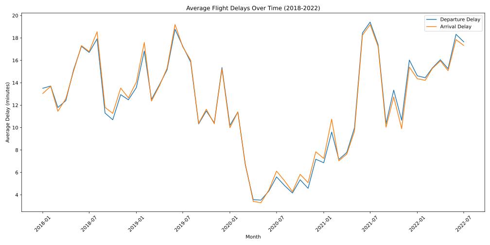
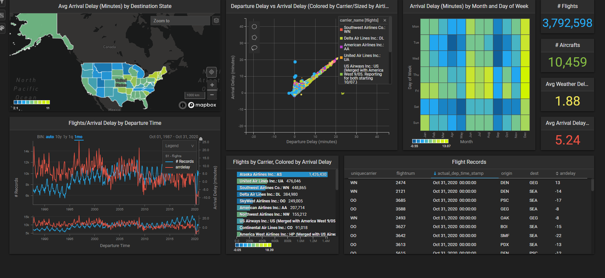
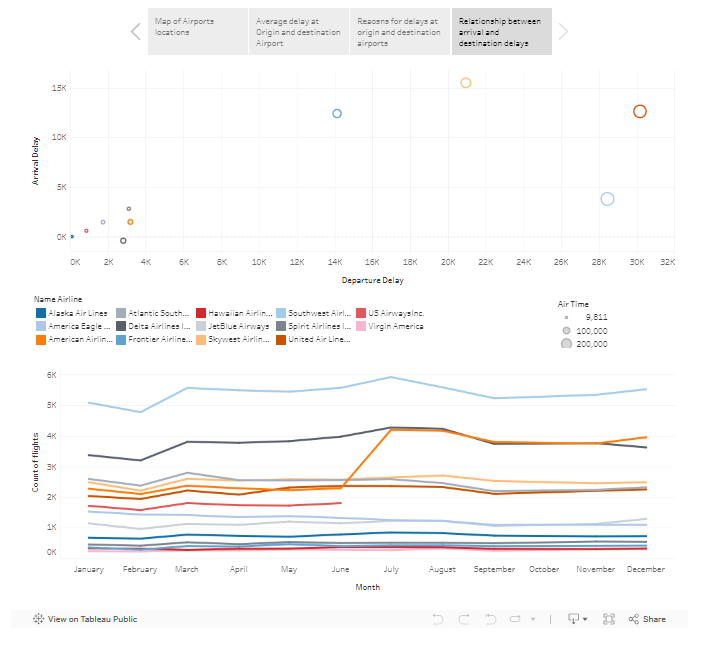
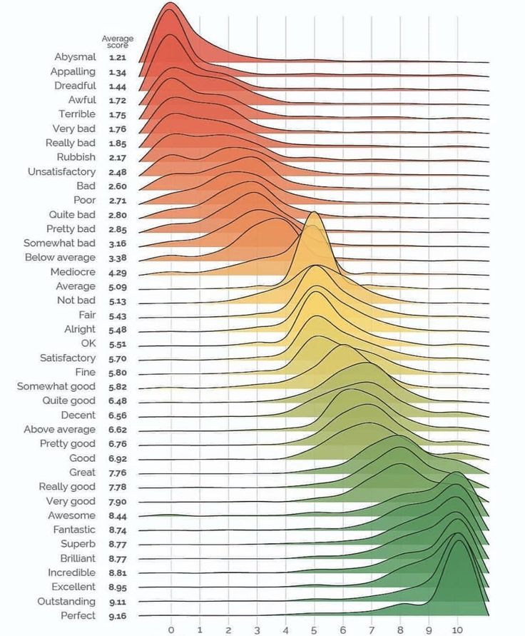
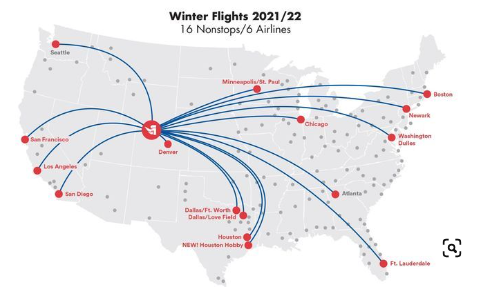
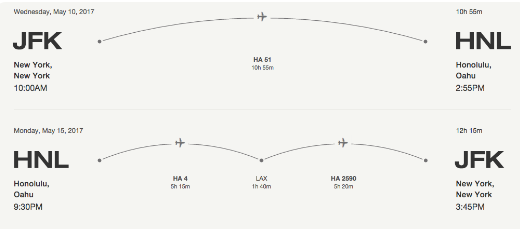

# Project of Data Visualization (COM-480)

| Student's name                    | SCIPER |
| --------------------------------- | ------ |
| Diogo Valdivieso Damasio Da Costa | 311673 |
| Tomas Valdivieso Damasio Da Costa | 300086 |
| Armance Nouvel                    | 330729 |

[Milestone 1](#milestone-1) • [Milestone 2](#milestone-2) • [Milestone 3](#milestone-3)

## Milestone 1 (29th March, 5pm)

**10% of the final grade**

This is a preliminary milestone to let you set up goals for your final project and assess the feasibility of your ideas. Please, fill the following sections about your project.

_(max. 2000 characters per section)_

### Dataset

We are using a dataset from the Bureau of Transportation Statistics : "On-Time : Marketing Carrier On-Time Performance". It contains critical information on commercial US flights. For example scheduled and actual departure and arrival times, canceled and diverted flights, causes of delay and cancellation, air time among others. Because of the provided interface we can directly pick which features to keep before downloading the data, which reduces the amount of filtering needed.

The data is well kept and sources by the US government so we expect minimal data cleaning to be necessary. Although during our preliminary exploratory data analysis, we identified significant gaps in data across several variables.

The dataset source : https://www.transtats.bts.gov/DL_SelectFields.aspx?gnoyr_VQ=FGK&QO_fu146_anzr=b0-gvzr

### Problematic

In today's interconnected world, air travel plays a crucial role. However, the complexity of flight data makes it often difficult to analyze and understand for ordinary users. This presents an opportunity for insightful analysis and visualization. Visualizations in this domain are particularly interesting because it offers an intuitive way to comprehend vast amounts of data related to flights, including routes, frequencies, delays, and passenger volumes. By presenting this information visually through charts, graphs, and maps, stakeholders such as airlines, airport authorities, and travelers can quickly identify patterns, trends, and anomalies. Our primary aim is to provide a user-friendly interface that allows users to explore various flight and airport details, facilitating informed decision-making and improving overall air travel experiences. Our target audience consists of individual travelers providing them comprehensive and easily accessible flight information.
 
Through our analysis and visualizations, we will address the following types of questions :
-       Are there any noticeable seasonal trends in flight delays for specific destinations?
-       What is the busiest time of day for flight departures at a particular airport?
-       Which airport experiences the highest frequency of delays?
-       What is the average delay time for flights departing from a specific airport?
-       What is the typical duration of flights between two specific airports?
 
 
We will focus on two main axes : 
-       The first part will involve exploration, featuring an interactive map allowing users to select departure and arrival airports. This section will provide various flight and airport details, including departure time, delays, and flight frequency, cancellations…. We will also incorporate dynamic visualizations for every trip, complete with animated flight data.
 
-       The second part will focus on analysis, presenting correlations between different flight features. As an example, we could present a graph demonstrating how the frequency of flight delays correlates with the date of the flight. By examining the results, we can establish connections between events during specific periods. For instance, as shown in the exploratory graph below, we observe a significant decrease in delays during the Covid period, corresponding to the substantial reduction in flight volume during that time.

### Exploratory Data Analysis

The analysis of flight delay data reveals key insights: the average delay is 12.7 minutes, with a high standard deviation of 44 minutes indicating varied delay lengths. Most flights are on time, as the median delay is 0 minutes, yet the maximum delay recorded is significantly high at 7,223 minutes. Notably, 37.25% of the data on departure delays is missing, highlighting the need for careful data handling.

Here is a table summarising the key insights:

| Statistic          | Departure Delays (minutes) |
| ------------------ | -------------------------- |
| Mean               | 12.7                       |
| Standard Deviation | 44                         |
| Minimum            | 0                          |
| 25%                | 0                          |
| 50% (Median)       | 0                          |
| 75%                | 5                          |
| Maximum            | 7 223                      |
| Missing Values (%) | 37.25                      |

The accompanying visualization showcases trends in average flight delays from 2018 to 2022, providing a basis for understanding delay patterns and aiding in improving airline operational efficiency. Notice the effect of the Covid-19 pandemic during 2020!

<!--

    

 -->

### Related work

> - What others have already done with the data?

Many flight data visualizations using this data used tools like Tableau or a visualization library like d3.js. The visualization focused on showcasing airline performance, including delays and cancellations. This data was often reported as a dashboard and data dense.

Analysis of flights delay data showing diverse data, for example:

From https://www.heavy.ai/demos/flights or

> - Why is your approach original?

We will focus on making the data as interactive as possible, making the data less dense to digest. For example, they can look for data of a particular route or the punctuality of planes departing from a specific airport. By doing this, we enable users to find insights pertinent to their travel habits and satisfy their own curiosity while simultaneously making the data less dense and easier to understand.

> - What source of inspiration do you take? Visualizations that you found on other websites or magazines (might be unrelated to your data).

I’ve put images of some visualizations that we liked:

## Milestone 2 (26th April, 5pm)

**10% of the final grade**

## Milestone 3 (31st May, 5pm)

**80% of the final grade**

## Late policy

- < 24h: 80% of the grade for the milestone
- < 48h: 70% of the grade for the milestone
